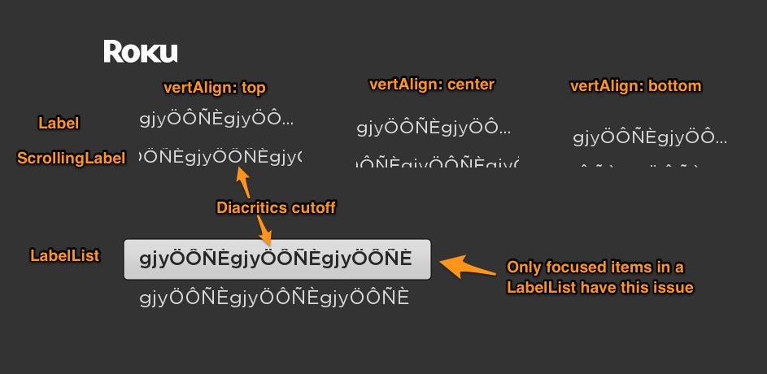

# Roku SceneGraph ScrollingLabel text clipping

This is a reduced test case demonstrating the odd text clipping behavior of a ScrollingLabel. This is particularly true when it comes to diacritics or if `vertAlign` is set.

## Confirmed on:

- Roku v8.0.0

## License

This is released under the MIT license. See [LICENSE.md](LICENSE.md) for more information.
